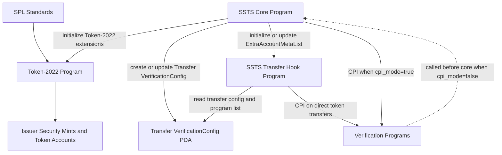
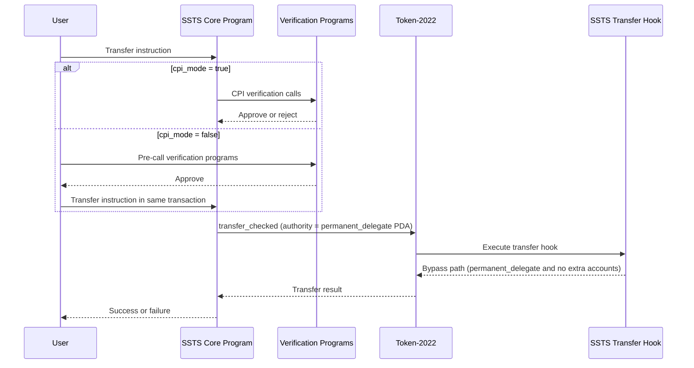
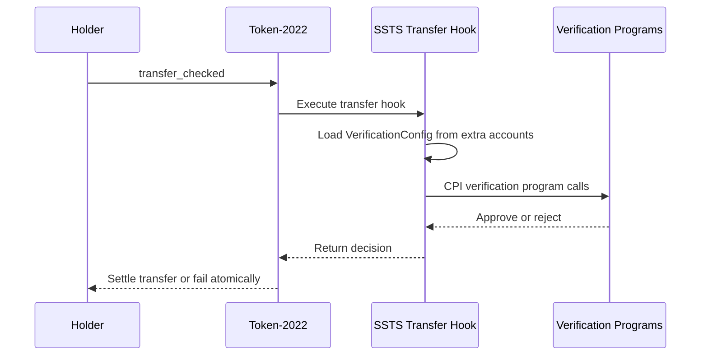

# Solana Security Token Standard (SSTS)

SSTS is a foundation-led initiative focused on open standards for regulated tokenized securities on Solana. The goal is to provide a practical baseline for issuance, transfer controls, and long-term lifecycle operations that institutions can use in production.

## Foundation Mission

The foundation’s role is to steward a neutral, reusable standard for compliant digital securities. Rather than forcing each issuer to design policy infrastructure from scratch, SSTS defines shared patterns that can be adopted, audited, and extended across markets.

## What The Standard Defines

SSTS builds on SPL Token-2022 and introduces a configurable verification model so compliance behavior can adapt to local regulatory requirements. The core protocol stays stable, while verification logic can evolve for KYC and AML controls, investor qualification policies, transfer approvals, and related operational rules. The standard also supports broader lifecycle flows, including issuance, policy-aware transfer, and corporate actions such as splits, conversions, and distributions.

The diagrams below separate architecture from runtime behavior and show the two transfer paths the implementation supports.

Forced transfer via SSTS core instruction (`SecurityTokenInstruction::Transfer`):

Direct Token-2022 wallet transfer:

## Why This Matters

Tokenized securities require more than token movement. They require policy enforcement, auditability, and repeatable operational workflows. SSTS is designed to provide that shared infrastructure so institutions can focus on product and market design, instead of rebuilding core compliance and servicing rails each time.

## Stewardship

SSTS is developed with contributions from Halborn, Hoodies, and a panel of industry experts, with support from the Solana Foundation.

This organization is at an early stage. Today, it is focused on the core standard and its reference implementation. As the initiative matures, this org will gradually expand to include clearer implementation guidance, practical examples, and selected documentation artifacts, including material that may be synchronized from the GitBook docs when appropriate.

## Learn More

Visit [ssts.org](https://ssts.org) for broader context and current initiative updates.
